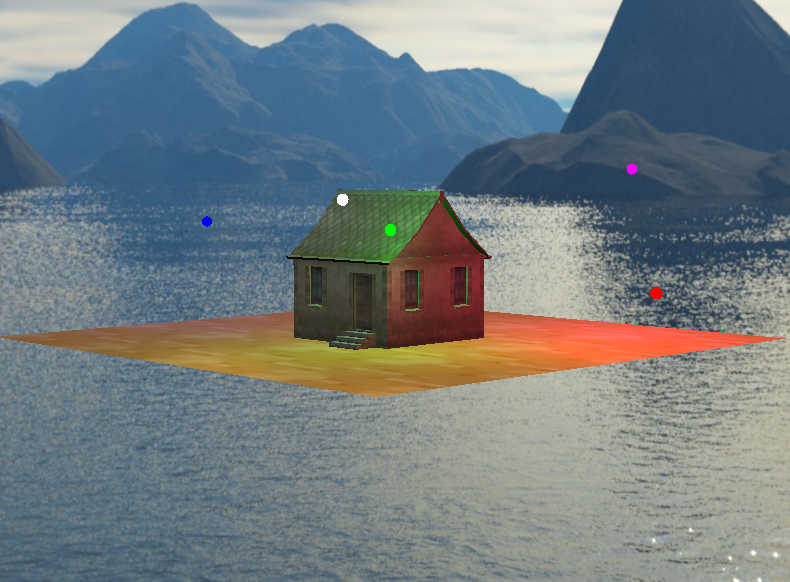
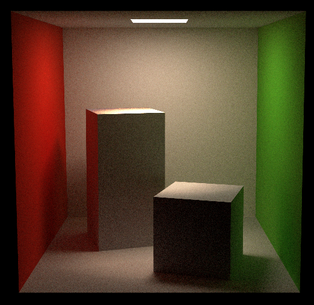

# LearningOpenGL
## 基础说明

该项目分为两个部分，第一部分主要涉及光栅化的内容，第二部分主要涉及光线追踪的内容。
- 光栅化渲染器Rasterization：通过将三维物体的几何信息转换为二维图像上的像素点来生成最终的图像。

- 路径追踪渲染器Path tracing：康奈尔盒路径追踪是一种基于蒙特卡洛方法的渲染算法，该算法跟踪场景中光的传播路径，计算像素颜色值，并生成高质量和现实的图像。

## 项目结构
LearningOpenGL
- include：核心工具类和基础库。
  几何计算(geometry)、OpenGL加载器(glad/GLFW)、数学库(glm)、界面库(imgui)、关键工具类tool。
  
- src_rasterization：光栅化内容
  
  
  
- src_raytracing：光线追踪内容
  
  
  
- static：资源文件
  book参考书
  model模型文件
  texture纹理图片

## 环境配置
- 下载Msys2，并在MinGW64环境中下载Assimp库。
之后使用Cmake插件来运行项目。
- 在src_rasterization和src_raytracing两个文件夹中的每一个单独文件夹都会有对应的main.cpp文件，只需修改CMakeLists.txt中add_executable的main.cpp路径就可以运行对应单元代码。

## 参考
Learning OpenGL by: 
- https://learnopengl-cn.github.io/intro/

Learning Path tracing by: 
- https://raytracing.github.io/books/RayTracingTheRestOfYourLife.html

Cornell Box Data: 
- https://www.graphics.cornell.edu/online/box/data.html

Reference code: 
- https://github.com/Azalea8/OpenGL_RayTracer 
- https://github.com/feimos32/RayTracerBasedOnGLSL
- https://github.com/AKGWSB/EzRT
- https://github.com/sunflower7910/PathTracing_CG