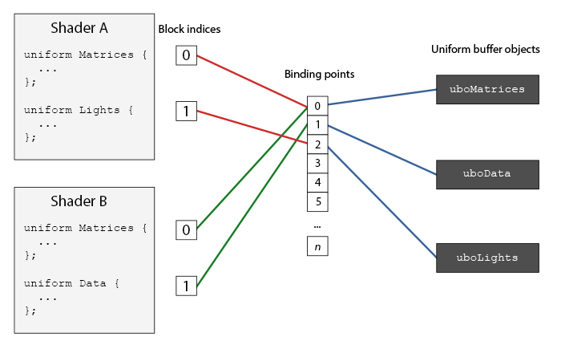

## Uniform块布局

### Uniform缓冲完整实现示例

#### 1. 着色器定义

```glsl
// 顶点着色器
#version 330 core
layout (std140) uniform ExampleBlock {
    float value;
    vec3  vector;
    mat4  matrix;
    float values[3];
    bool  boolean;
    int   integer;
};
// ... 其他着色器代码
```

#### 2. 内存布局计算（std 140规则）

| 成员变量 | 类型 | 基准对齐 | 计算偏移量 | 占用空间 |
|---------------|-----------|---------|-----------|---------|
| value | float | 4 | 0 | 4 |
| vector | vec3 | 16 | 16 | 12 |
| matrix | mat4 | 16 | 32 | 64 |
| values[3] | float[3] | 16 | 96 | 48 |
| boolean | bool | 4 | 144 | 4 |
| integer | int | 4 | 148 | 4 |

总缓冲大小：152字节

#### 3. C++端实现步骤

##### 3.1 创建Uniform缓冲

```c++
// 生成缓冲对象
GLuint uboExampleBlock;
glGenBuffers(1, &uboExampleBlock);

// 绑定并分配内存
glBindBuffer(GL_UNIFORM_BUFFER, uboExampleBlock);
glBufferData(GL_UNIFORM_BUFFER, 152, NULL, GL_DYNAMIC_DRAW);
glBindBuffer(GL_UNIFORM_BUFFER, 0);
```

##### 3.2 绑定到指定位置



```c++
// 获取Uniform块索引
GLuint blockIndex = glGetUniformBlockIndex(shaderProgram, "ExampleBlock");

// 将块绑定到绑定点2
glUniformBlockBinding(shaderProgram的ID, blockIndex, 2);

// 将缓冲绑定到相同绑定点
glBindBufferBase(GL_UNIFORM_BUFFER, 2, uboExampleBlock);
// 或
glBindBufferRange(GL_UNIFORM_BUFFER, 2, uboExampleBlock, 0, 152);
```

##### 3.3 填充数据示例

```c++
// 准备数据
float value = 3.14f;
glm::vec3 vector(1.0f, 2.0f, 3.0f);
glm::mat4 matrix = glm::mat4(1.0f);
float values[3] = {4.0f, 5.0f, 6.0f};
GLint boolean = GL_TRUE; // 注意：GLSL中bool占4字节
GLint integer = 42;

// 更新缓冲
glBindBuffer(GL_UNIFORM_BUFFER, uboExampleBlock);

// 按偏移量填充数据
glBufferSubData(GL_UNIFORM_BUFFER, 0,   4, &value);    // value
glBufferSubData(GL_UNIFORM_BUFFER, 16,  12, &vector);  // vector
glBufferSubData(GL_UNIFORM_BUFFER, 32,  64, &matrix);  // matrix
glBufferSubData(GL_UNIFORM_BUFFER, 96,  12, values);   // values[3]
glBufferSubData(GL_UNIFORM_BUFFER, 144, 4, &boolean);  // boolean
glBufferSubData(GL_UNIFORM_BUFFER, 148, 4, &integer);  // integer

glBindBuffer(GL_UNIFORM_BUFFER, 0);
```

#### 4. 多着色器共享配置

```c++
// 对每个使用该Uniform块的着色器执行绑定
void LinkShaderToUBO(GLuint shaderProgram) {
    GLuint blockIndex = glGetUniformBlockIndex(shaderProgram, "ExampleBlock");
    if(blockIndex != GL_INVALID_INDEX) {
        glUniformBlockBinding(shaderProgram的ID, blockIndex, 2);
    }
}
```

#### 5. 动态更新数据

```c++
// 更新单个变量（例如boolean）
void UpdateBoolean(bool newValue) {
    glBindBuffer(GL_UNIFORM_BUFFER, uboExampleBlock);
    GLint b = newValue ? GL_TRUE : GL_FALSE;
    glBufferSubData(GL_UNIFORM_BUFFER, 144, 4, &b);
    glBindBuffer(GL_UNIFORM_BUFFER, 0);
}
```


### 一个简单的例子

使用Uniform缓冲对象(Uniform Buffer Object = UBO)实现多着色器共享视图/投影矩阵的完整案例。以下是分步骤的详细说明：

#### 1. 着色器定义（关键部分）

顶点着色器：

```glsl
#version 330 core
layout (location = 0) in vec3 aPos;

layout (std140) uniform Matrices {
    mat4 projection;
    mat4 view;
};

uniform mat4 model;

void main() {
    gl_Position = projection * view * model * vec4(aPos, 1.0);
}
```

- 定义包含两个矩阵的Uniform块，一个投影矩阵（将投影矩阵的视野FOV(Field of View)值保持不变（所以摄像机就没有缩放了）），另一个视图矩阵，在不同的着色器中模型矩阵是不同的，所以不写到Uniform块中。

- 使用std140内存布局保证对齐

- 所有着色器共享相同的projection和view矩阵

#### 2. UBO初始化流程

```c++
// 获取所有着色器的Uniform块索引
unsigned int uniformBlockIndexRed = glGetUniformBlockIndex(shaderRed.ID, "Matrices");
// ... 其他着色器类似
unsigned int uniformBlockIndexGreen  = glGetUniformBlockIndex(shaderGreen.ID, "Matrices");
unsigned int uniformBlockIndexBlue   = glGetUniformBlockIndex(shaderBlue.ID, "Matrices");
unsigned int uniformBlockIndexYellow = glGetUniformBlockIndex(shaderYellow.ID, "Matrices");  

// 将块绑定到统一绑定点0
glUniformBlockBinding(shaderRed.ID, uniformBlockIndexRed, 0);
// ... 其他着色器相同操作
glUniformBlockBinding(shaderGreen.ID,  uniformBlockIndexGreen, 0);
glUniformBlockBinding(shaderBlue.ID,   uniformBlockIndexBlue, 0);
glUniformBlockBinding(shaderYellow.ID, uniformBlockIndexYellow, 0);

// 创建UBO(Uniform缓冲对象本身)，并将其绑定到绑定点0
unsigned int uboMatrices;
glGenBuffers(1, &uboMatrices);

glBindBuffer(GL_UNIFORM_BUFFER, uboMatrices);
glBufferData(GL_UNIFORM_BUFFER, 2 * sizeof(glm::mat4), NULL, GL_STATIC_DRAW);
glBindBuffer(GL_UNIFORM_BUFFER, 0);

// 绑定UBO到绑定点0，范围覆盖两个mat4
glBindBufferRange(GL_UNIFORM_BUFFER, 0, uboMatrices, 0, 2*sizeof(glm::mat4));
```

#### 3. 数据填充

因为我们已经为缓冲对象分配了足够的内存，我们可以使用glBufferSubData在进入渲染循环之前存储投影矩阵：

```c++
// 初始化时设置投影矩阵（只需设置一次）
glm::mat4 projection = glm::perspective(45.0f, (float)SCR_WIDTH/SCR_HEIGHT, 0.1f, 100.0f);
glBindBuffer(GL_UNIFORM_BUFFER, uboMatrices);
glBufferSubData(GL_UNIFORM_BUFFER, 0, sizeof(glm::mat4), glm::value_ptr(projection));
glBindBuffer(GL_UNIFORM_BUFFER, 0);
```

这里我们将投影矩阵储存在Uniform缓冲的前半部分。

在每次渲染迭代中绘制物体之前，我们会将观察矩阵更新到缓冲的后半部分：

```c++
// 每帧更新视图矩阵（渲染循环内）
glm::mat4 view = camera.GetViewMatrix();
glBindBuffer(GL_UNIFORM_BUFFER, uboMatrices);
glBufferSubData(GL_UNIFORM_BUFFER, sizeof(glm::mat4), sizeof(glm::mat4), glm::value_ptr(view));
glBindBuffer(GL_UNIFORM_BUFFER, 0);
```

实际渲染循环中，还需有设置不同的模型矩阵：

```c++
while (!glfwWindowShouldClose(window)) {
    // 更新视图矩阵到UBO
    glm::mat4 view = camera.GetViewMatrix();
    glBindBuffer(GL_UNIFORM_BUFFER, uboMatrices);
    glBufferSubData(..., sizeof(glm::mat4), ..., &view);
    glBindBuffer(GL_UNIFORM_BUFFER, 0);
    
    // 绘制各色立方体
    // 绘制红色立方体
    shaderRed.use();
    model = glm::translate(..., vec3(-0.75f, 0.75f, 0.0f));
    shaderRed.setMat4("model", model); // 单独设置每个model矩阵
    glDrawArrays(GL_TRIANGLES, 0, 36);
    
    // 绘制绿色立方体
    shaderGreen.use();
    model = glm::translate(..., vec3(-0.25f, 0.25f, 0.2f));
    shaderGreen.setMat4("model", model); // 单独设置每个model矩阵
    glDrawArrays(...);
    
    // 其他颜色立方体同理...
	
}
```

内存布局说明：

```txt
+-----------------+----------------+
| projection矩阵  | view矩阵       | 
| (64字节)        | (64字节)       |
+-----------------+----------------+
0              64              128
```

- 使用glBufferSubData分别更新两个矩阵区域

- 偏移量0处存储projection矩阵

- 偏移量64处存储view矩阵

唯一需要设置的uniform只剩model uniform了。在像这样的场景中使用Uniform缓冲对象会让我们在每个着色器中都剩下一些uniform调用。最终的结果会是这样的：


因为修改了模型矩阵，每个立方体都移动到了窗口的一边，并且由于使用了不同的片段着色器，它们的颜色也不同。这只是一个很简单的情景，我们可能会需要使用Uniform缓冲对象，但任何大型的渲染程序都可能同时激活有上百个着色器程序，这时候Uniform缓冲对象的优势就会很大地体现出来了。

### Uniform块布局好处

Uniform缓冲对象比起独立的uniform有很多好处。

- 第一，一次设置很多uniform会比一个一个设置多个uniform要快很多。
- 第二，比起在多个着色器中修改同样的uniform，在Uniform缓冲中修改一次会更容易一些。
- 最后一个好处可能不会立即显现，如果使用Uniform缓冲对象的话，你可以在着色器中使用更多的uniform。OpenGL限制了它能够处理的uniform数量，这可以通过GL_MAX_VERTEX_UNIFORM_COMPONENTS来查询。当使用Uniform缓冲对象时，最大的数量会更高。所以，当你达到了uniform的最大数量时（比如再做骨骼动画(Skeletal Animation)的时候），你总是可以选择使用Uniform缓冲对象。
