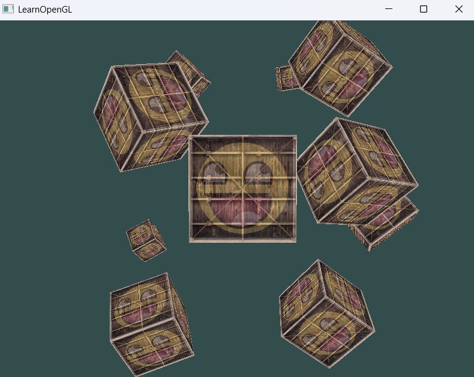

# 00_Raytracing_02

这是光线追踪系列的第二个示例程序，基于OpenGL实现了3D场景渲染、摄像机控制系统以及纹理映射，为光线追踪算法提供交互式基础框架。

## 功能特性
- 交互式3D场景渲染（10个纹理立方体）
- 完整的相机控制系统
  - WASD键移动相机位置
  - 鼠标控制视角旋转
  - 鼠标滚轮调整视野角度(FOV)
- 纹理加载与混合
- 透视投影与深度测试
- 基本3D变换（平移、旋转）

## 技术实现
使用GLM库进行数学计算和矩阵变换
自定义着色器加载系统
STB_image库处理纹理图像
帧率独立的相机移动

## 控制说明
W/S - 前进/后退
A/D - 左移/右移
鼠标 - 调整视角
滚轮 - 缩放(调整FOV)
ESC - 退出程序

