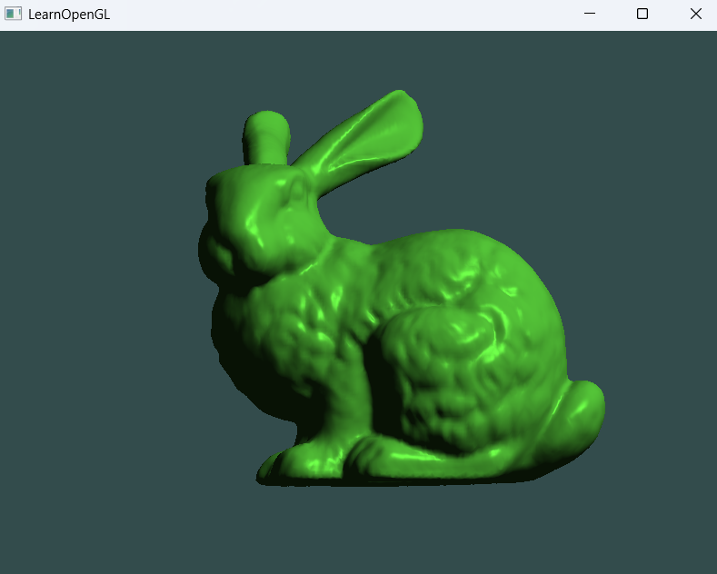

# 00_Raytracing_03

这是光线追踪系列的第三个示例程序，从立方体纹理渲染进阶到外部3D模型加载与渲染，实现了Stanford兔子模型的显示，为后续的光线追踪打下坚实基础。

## 功能特性
- 3D模型加载与渲染系统
- 完整的相机控制交互
  - WASD键移动相机位置
  - 鼠标控制视角旋转（灵敏度优化为0.03f）
  - 鼠标滚轮调整视野角度(FOV)
- 深度测试与基础着色
- 3D模型的位置与缩放控制

## 技术实现
- 自定义Model类用于加载和渲染外部3D模型
- Mesh类实现网格数据管理与渲染
- 视图与投影矩阵管理
- 向着色器传递相机位置(viewPos)，为光照计算做准备

## 控制说明
W/S - 前进/后退
A/D - 左移/右移
鼠标 - 调整视角(灵敏度: 0.03f)
滚轮 - 缩放(调整FOV: 1.0°-45.0°)
ESC - 退出程序

