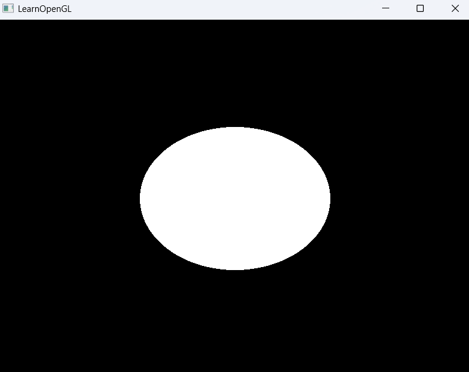

# 00_Raytracing_04

这是光线追踪系列的第四个示例程序，标志着从传统光栅化渲染向GPU光线追踪的过渡。本示例实现了全屏四边形渲染，将计算任务转移至片段着色器，为完全基于GPU的光线追踪算法奠定基础。

## 关键变更
- 渲染方式转变：从3D模型渲染转为全屏四边形渲染
- 计算迁移：核心渲染逻辑从CPU转移到GPU的片段着色器
- 架构重构：为基于像素的光线追踪建立渲染架构

## 技术实现
- 定义全屏四边形顶点（两个三角形组成）
- 移除深度测试，专注于2D表面渲染
- 通过片段着色器为每个像素计算颜色值
- 保留相机系统框架为后续光线方向计算做准备

## 光线追踪准备
此版本是实现光线追踪的基础架构，接下来片段着色器将实现：
- 基于像素位置生成光线
- 实现光线与场景求交
- 计算光照与阴影
- 材质模拟和光线反射/折射

