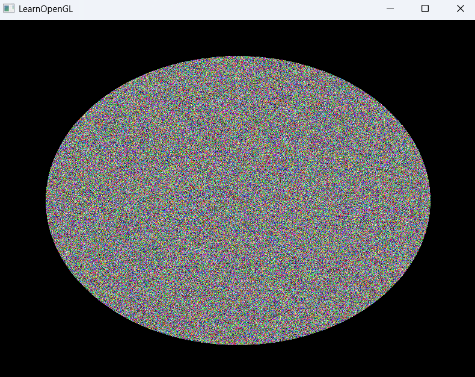

# 00_Raytracing_05

## 项目简介
这是光线追踪系列的第五个示例程序，在全屏四边形渲染基础上实现了GPU光线追踪的基本算法。片段着色器中包含光线生成与物体相交检测，实现了基本的光线追踪渲染效果。

## 关键特性
- 基于片段着色器的光线追踪实现
- 通过全屏四边形为每个像素生成光线
- 实现简单几何体（球体、平面等）的相交检测
- 鼠标指针可见（交互模式调整）
- 保留完整相机系统供光线方向计算

## 技术实现
- 保持与上一版本相同的渲染框架（全屏四边形）
- 在片段着色器中实现光线追踪算法核心：
  - 为每个像素生成对应的光线
  - 检测光线与场景物体的相交
  - 基于相交结果计算颜色
- 连接CPU端相机系统与GPU端光线方向计算

## 代码亮点
```cpp
// 鼠标可见性变化（与前版本的区别）
//glfwSetInputMode(window, GLFW_CURSOR, GLFW_CURSOR_DISABLED);

// 渲染循环中的关键渲染调用
ourShader.use();
glBindVertexArray(VAO);
glDrawArrays(GL_TRIANGLES, 0, 6);
```

## 光线追踪实现要点
- **光线表示**: 使用起点(origin)和方向(direction)定义
- **相交算法**: 实现光线与简单几何体的相交计算
- **着色模型**: 基于相交点计算颜色值
- **视图变换**: 将相机参数传递给着色器用于光线生成

## 与前一版本的区别
本示例主要在片段着色器中添加了光线追踪的核心算法，而C++部分框架基本保持不变。主要变化点：
- 片段着色器中实现光线生成和相交检测
- 鼠标指针现在可见（便于操作界面）
- 渲染输出从单色切换到光线追踪效果

