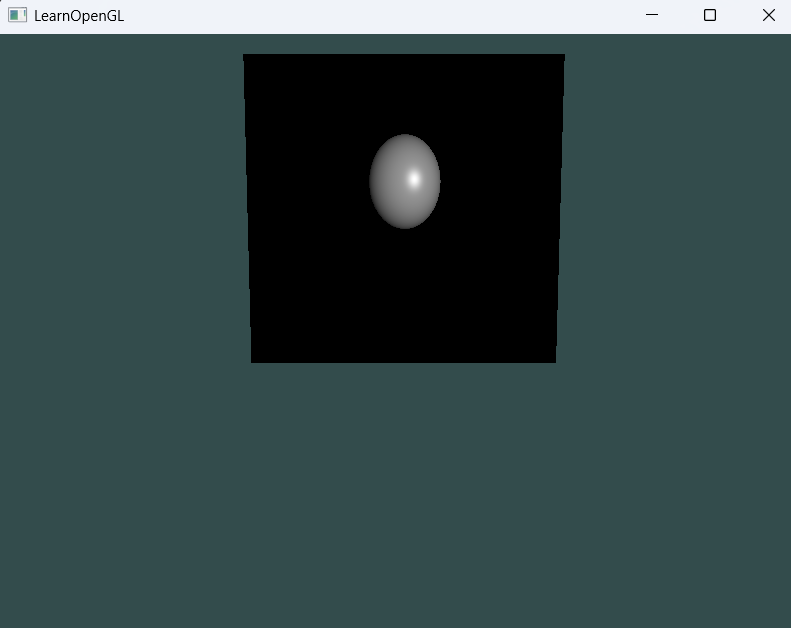

# 00_Raytracing_06

## 项目简介
这是光线追踪系列的第六个示例程序，对前一版本进行了代码重构与架构优化。引入了面向对象的相机系统和专用的屏幕渲染类，构建了更灵活、更易扩展的光线追踪框架。

## 架构升级
- **面向对象重构**：将之前内联在main.cpp的功能模块化为独立类
- **相机系统封装**：引入专用Camera类管理视角和交互
- **时间系统优化**：添加TimeRecorder类处理时间相关计算
- **屏幕渲染抽象**：使用RT_Screen类专门负责全屏四边形的管理

## 技术实现
- 模块化的Camera类处理所有相机参数和变换
- 相机参数直接传递给着色器统一变量
- 动态适应窗口大小调整，自动更新相机参数
- 时间系统支持平滑的相机移动

## 代码结构
```cpp
// 关键类初始化
Camera cam(SCR_WIDTH, SCR_HEIGHT, glm::vec3(0.0f, 0.0f, 3.0f));
timeRecord timeRecorder;
RT_Screen screen;

// 渲染循环
while (!glfwWindowShouldClose(window)) {
    // 时间计算
    timeRecorder.updateTime();
    
    // 向着色器传递相机参数（更系统化）
    ourShader.setVec3("camera.camPos", cam.Position);
    ourShader.setVec3("camera.front", cam.Front);
    ourShader.setVec3("camera.right", cam.Right);
    ourShader.setVec3("camera.up", cam.Up);
    ourShader.setFloat("camera.halfH", cam.halfH);
    ourShader.setFloat("camera.halfW", cam.halfW);
    ourShader.setVec3("camera.leftbottom", cam.LeftBottomCorner);
    
    // 抽象的屏幕绘制
    screen.DrawScreen();
}
```

## 与前一版本的区别
| 功能 | 00_Raytracing_05 | 00_Raytracing_06 |
|------|-----------------|-----------------|
| 相机系统 | 全局变量直接管理 | Camera类封装 |
| 时间处理 | 内联计算 | TimeRecorder类 |
| 屏幕渲染 | 直接VAO操作 | RT_Screen抽象类 |
| 窗口适配 | 固定大小 | 动态调整并更新相机 |
| 参数传递 | 分散传递 | 统一camera结构 |

## 改进的交互机制
- 窗口大小变化时自动更新相机参数
```cpp
void framebuffer_size_callback(...) {
    SCR_WIDTH = width;
    SCR_HEIGHT = height;
    cam.updateScreenRatio(SCR_WIDTH, SCR_HEIGHT);
    // ...
}
```

- 模块化的输入处理
```cpp
void processInput(...) {
    if (glfwGetKey(window, GLFW_KEY_W) == GLFW_PRESS)
        cam.ProcessKeyboard(FORWARD, timeRecorder.deltaTime);
    // ...
}
```


