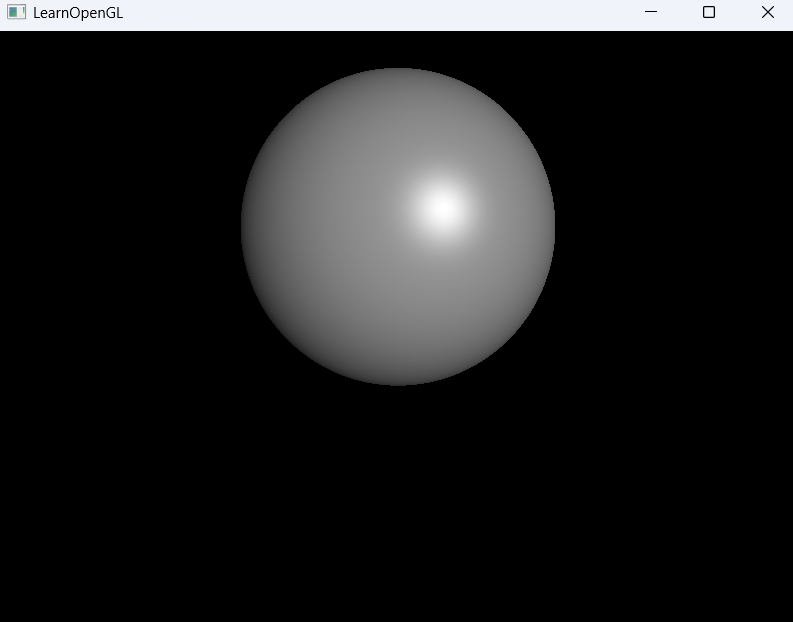

# 01_Raytracing_01

## 项目简介
这是光线追踪系列的新阶段示例，实现了帧缓冲对象(FBO)和多帧累积渲染系统，为路径追踪算法奠定了基础。通过存储和累积多个渲染帧，可以显著降低噪点，提高图像质量。

## 核心创新
- **帧缓冲对象系统**：引入ScreenFBO类管理离屏渲染
- **双管线渲染架构**：分离光线追踪计算和帧累积显示
- **多帧累积**：实现历史帧与当前帧的混合显示
- **优化的屏幕渲染**：使用RT_Screen_2D专用类处理2D纹理绘制

## 渲染管线
本版本建立了两阶段渲染管线：
1. **光线追踪阶段**：使用RayTracerShader计算当前帧的渲染结果，输出到FBO
2. **累积显示阶段**：使用ScreenShader将当前帧与历史帧混合，并显示到屏幕

## 技术实现
```cpp
// 两个核心着色器
Shader RayTracerShader = Shader::FromFile("../src_raytracing/01_Raytracing_01/shader/RayTracerVertexShader.glsl", 
                                         "../src_raytracing/01_Raytracing_01/shader/RayTracerFragmentShader.glsl");
Shader ScreenShader = Shader::FromFile("../src_raytracing/01_Raytracing_01/shader/ScreenVertexShader.glsl", 
                                      "../src_raytracing/01_Raytracing_01/shader/ScreenFragmentShader.glsl");

// 帧缓冲对象
screenBuffer.configuration(SCR_WIDTH, SCR_HEIGHT);

// 渲染过程
// 1. 先渲染到FBO
screenBuffer.Bind();
RayTracerShader.use();
// 设置相机参数...
screen.RenderToFramebuffer();
screenBuffer.unBind();

// 2. 再渲染到屏幕
ScreenShader.use();
screenBuffer.BindAsTexture();
ScreenShader.setInt("camera.LoopNum", cam.LoopNum);
screen.DrawTextureQuad();
```

## 帧累积系统
- **帧计数器**：相机类中添加LoopNum计数器，记录累积的帧数
- **重置机制**：相机移动或旋转时，LoopNum重置为零，开始新的累积
- **混合权重**：根据累积帧数动态计算当前帧的权重，实现渐进式降噪

## 代码优化
- **资源管理**：添加了显式的资源释放
```cpp
// 条件终止前释放资源
screenBuffer.Delete();
screen.Delete();
```

- **明确的渲染调用**：区分FBO绘制和屏幕绘制
```cpp
screen.RenderToFramebuffer();  // 渲染到FBO
screen.DrawTextureQuad();      // 渲染到屏幕
```

## 渲染效果说明
- 静止相机时：随着帧数增加，图像噪点逐渐减少，细节更加清晰
- 移动相机时：从噪点较多的状态逐渐清晰化
- 长时间累积后：可达到较高质量的渲染效果


