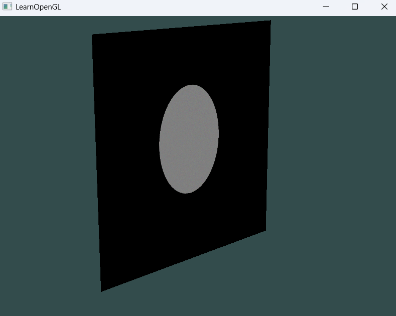

# 01_Raytracing_02

## 项目简介
这是光线追踪系列的进阶版本，实现了基于蒙特卡洛采样的渐进式路径追踪渲染系统。通过随机采样和时域累积技术，实现高质量的全局光照效果，渲染结果会随着累积帧数增加而逐渐收敛降噪。

## 核心改进
- **随机采样系统**：引入CPU和GPU随机数生成工具
- **渐进式渲染框架**：实现基于递推公式的时域累积
- **优化的缓冲结构**：使用RenderBuffer替代原有ScreenFBO
- **着色器间数据传递**：历史帧结果传入光线追踪着色器
- **随机源传递**：将CPU生成的随机种子传递到着色器


## 技术实现
```cpp
// 随机数初始化
CPURandomInit();

// 渲染循环中向着色器传递随机种子
RayTracerShader.setFloat("randOrigin", 674764.0f * (GetCPURandom() + 1.0f));

// 帧累积计数
cam.LoopIncrease();

// 设置当前缓冲
screenBuffer.setCurrentBuffer(cam.LoopNum);

// 在光线追踪着色器中使用历史帧
RayTracerShader.setInt("historyTexture", 0);
```

## 渲染管线优化
上一版本的RenderBuffer结构得到了增强，能更高效地管理帧累积：
- **帧切换**：通过`setCurrentBuffer`根据累积帧数切换缓冲区
- **历史帧访问**：着色器可访问历史帧数据进行累积计算
- **Y轴旋转**：添加了模型矩阵的45度旋转，增强场景效果
- **随机性控制**：每帧传递不同的随机种子，避免重复采样模式


## 渐进式渲染公式推导

### 递推公式
$$
S_N = \frac{1}{N}x_N + \frac{N-1}{N}S_{N-1}
$$

### 展开形式
$$
S_N = \frac{1}{N}\sum_{i=1}^{N}x_i = \frac{x_1 + x_2 + \cdots + x_N}{N}
$$

$$
\begin{align*}
S_{k+1} &= \frac{1}{k+1}x_{k+1} + \frac{k}{k+1}S_k \\
&= \frac{1}{k+1}x_{k+1} + \frac{k}{k+1}\left(\frac{1}{k}\sum_{i=1}^{k}x_i\right) \\
&= \frac{1}{k+1}\sum_{i=1}^{k+1}x_i
\end{align*}
$$

$$
S_N = \frac{1}{N}\sum_{i=1}^{N}x_i
$$

### 分步示例

1. **N=1**：
$$
S_1 = x_1
$$

2. **N=2**：
$$
S_2 = \frac{x_1 + x_2}{2}
$$

3. **N=3**：
$$
S_3 = \frac{x_1 + x_2 + x_3}{3}
$$

### 工程实现
当前颜色计算：

```glsl
			// 渐进式渲染的时域累积
			// 当前颜色 = 当前帧颜色 + 历史帧颜色
			// 循环开始LoopNum就加1，所以uniform LoopNum设置时已经是1了。之后每循环一次加1。			
			// 当前颜色 = (1/N) * 新采样颜色 + ((N-1)/N) * 历史颜色
			// 其实就是每帧颜色累加，然后除以帧数N。
			vec3 curColor = (1.0 / float(camera.LoopNum))*vec3(rand(), rand(), rand()) 
							+ (float(camera.LoopNum -1)/float(camera.LoopNum))*hist;
```
## 随机采样系统
- **CPU随机种子**：每帧生成并传递到着色器
- **GPU随机函数**：着色器内实现的伪随机数生成
- **采样策略**：随机像素采样减少固定模式噪声

## 控制体验
- 移动相机时会重置采样计数器，开始新一轮收敛
- 静止时图像会逐渐降噪并展现更多细节
- 性能与图像质量可通过调整采样次数平衡



