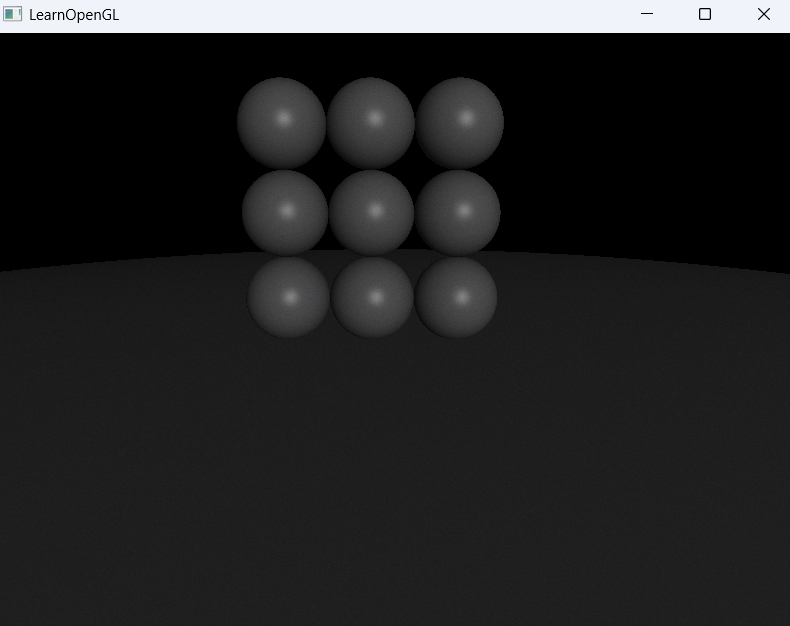

# 01_Raytracing_03


## 项目简介
这是光线追踪系列的第三个示例程序，在前一版本渐进式路径追踪框架基础上，实现了完整的球体场景渲染。本示例通过程序化生成多个球体对象，并使用光线追踪着色器计算球体与光线的交点、法线和颜色，呈现出一个简单但完整的3D场景。

## 核心特性
- **程序化场景生成**：动态创建10个球体构成场景
- **球体光线相交计算**：在GPU着色器中实现光线与球体相交算法
- **多物体渲染系统**：支持多个物体的组织和管理
- **光线散射处理**：实现基本的漫反射材质
- **底面大球体**：使用半径100的大球体模拟地面

## 技术实现
```cpp
// 球体数量赋值，绘制10个球体，前9个球体使用循环生成，最后一个球体是地板
RayTracerShader.setInt("sphereNum", 10);

// 使用循环生成前9个球体
int x_values[] = {0, 1, -1};
for (int i = 0; i < 9; ++i) {
    int y = i / 3;
    float x = x_values[i % 3];
    RayTracerShader.setFloat(("sphere[" + std::to_string(i) + "].radius").c_str(), 0.5f);
    RayTracerShader.setVec3(("sphere[" + std::to_string(i) + "].center").c_str(), 
        glm::vec3(x, y, -1.0f));
}

// 地板物体赋值
RayTracerShader.setFloat("sphere[9].radius", 100.0);
RayTracerShader.setVec3("sphere[9].center", glm::vec3(0.0, -100.5, -1.0));
```

## 场景布局
- **小球阵列**：9个半径为0.5的小球，排列在3×3的网格中
- **地面**：1个半径为100的大球体，中心位于(0, -100.5, -1)，模拟地面
- **空间分布**：
  - X轴：-1、0、1三个位置
  - Y轴：0、1、2三个高度层
  - Z轴：所有球体位于z=-1平面

## 渲染管线改进
- **对象传递**：C++端动态构建场景对象并传递给着色器
- **相交计算**：着色器内实现高效的光线-球体相交检测
- **多物体管理**：使用数组存储多个场景对象
- **可视化参数调整**：鼠标指针可见，便于调试和参数调整

## 渲染原理
1. **光线生成**：从相机位置向场景发射光线
2. **相交检测**：计算光线与所有场景物体的交点
3. **散射处理**：根据相交物体的材质计算光线散射方向
4. **颜色累积**：通过多次弹射和多帧累积计算最终颜色

## 相交算法
光线与球体相交的解析解：
- 光线方程：p(t) = o + td，其中o为光线起点，d为方向
- 球体方程：|p - c|² = r²，其中c为球心，r为半径
- 求解t值，若存在实数解，则光线与球体相交

## 实现细节
- 鼠标指针现在可见，便于调试和UI操作
- 使用了程序化布局替代硬编码的球体位置
- 地面球体使用超大半径，产生接近平面的效果
- 保留了渐进式渲染的累积机制，静止相机时图像质量会逐渐提升


