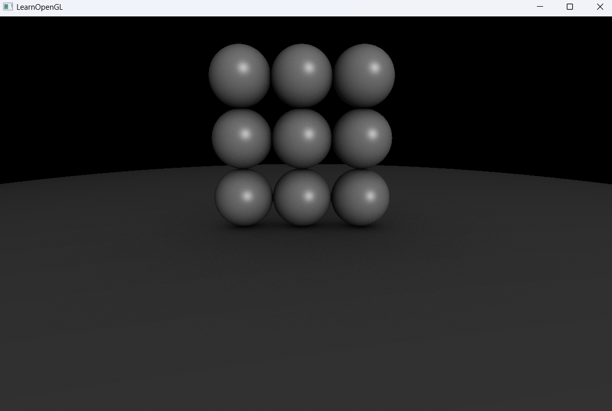

# 01_Raytracing_04


## 项目简介
这是光线追踪系列的第四个示例程序，对前一版本进行了分辨率提升和渲染质量优化。保持相同的球体场景布局，但通过增强着色器实现和渲染参数设置，提供了更高质量的光线追踪效果。

## 核心改进
- **高分辨率渲染**：窗口分辨率从800x600提升至1200x800
- **鼠标交互优化**：重新启用鼠标捕获模式，提供更沉浸的相机控制体验
- **渲染管线整合**：统一绘制调用，简化渲染流程
- **着色器优化**：改进片段着色器中的光线追踪和材质算法（在着色器文件中实现）
- **相同场景，更好效果**：保留原有场景布局，通过算法优化提高渲染质量

## 技术实现
```cpp
// 高分辨率设置
unsigned int SCR_WIDTH = 1200;
unsigned int SCR_HEIGHT = 800;

// 恢复鼠标捕获模式
glfwSetInputMode(window, GLFW_CURSOR, GLFW_CURSOR_DISABLED);

// 渲染流程优化
// 光线追踪渲染当前帧
screenBuffer.setCurrentBuffer(cam.LoopNum);
RayTracerShader.use();
// 设置相机和场景参数...
screen.DrawScreen();

// 渲染到屏幕
glBindFramebuffer(GL_FRAMEBUFFER, 0);
ScreenShader.use();
screenBuffer.setCurrentAsTexture(cam.LoopNum);
screen.DrawScreen();
```

## 场景结构
场景保持与前一版本相同的布局方案：
- 3×3网格排列的9个小球（半径0.5）：
  ```cpp
  int x_values[] = {0, 1, -1};
  for (int i = 0; i < 9; ++i) {
      int y = i / 3;
      float x = x_values[i % 3];
      RayTracerShader.setFloat(("sphere[" + std::to_string(i) + "].radius").c_str(), 0.5f);
      RayTracerShader.setVec3(("sphere[" + std::to_string(i) + "].center").c_str(), 
          glm::vec3(x, y, -1.0f));
  }
  ```
- 1个模拟地面的大球（半径100）：
  ```cpp
  RayTracerShader.setFloat("sphere[9].radius", 100.0);
  RayTracerShader.setVec3("sphere[9].center", glm::vec3(0.0, -100.5, -1.0));
  ```

## 渲染效果
- **更高分辨率**：1200x800的渲染分辨率带来更清晰的图像细节
- **更沉浸式交互**：鼠标捕获模式提供更直观的相机控制
- **相同场景更好质量**：着色器优化提供更精确的光线反射和材质表现

## 性能考量
- 分辨率提高会增加计算量，可能会影响渐进式渲染的收敛速度
- 建议在低端硬件上调整窗口大小以平衡质量和性能

## 与前版本的区别
| 特性 | 01_Raytracing_03 | 01_Raytracing_04 |
|------|------------------|-----------------|
| 分辨率 | 800x600 | 1200x800 |
| 鼠标模式 | 可见 | 隐藏捕获 |
| 渲染调用 | 分离的 | 统一的 |
| 场景布局 | 3×3网格+地面 | 相同 |
| 渲染质量 | 基础 | 增强 |



