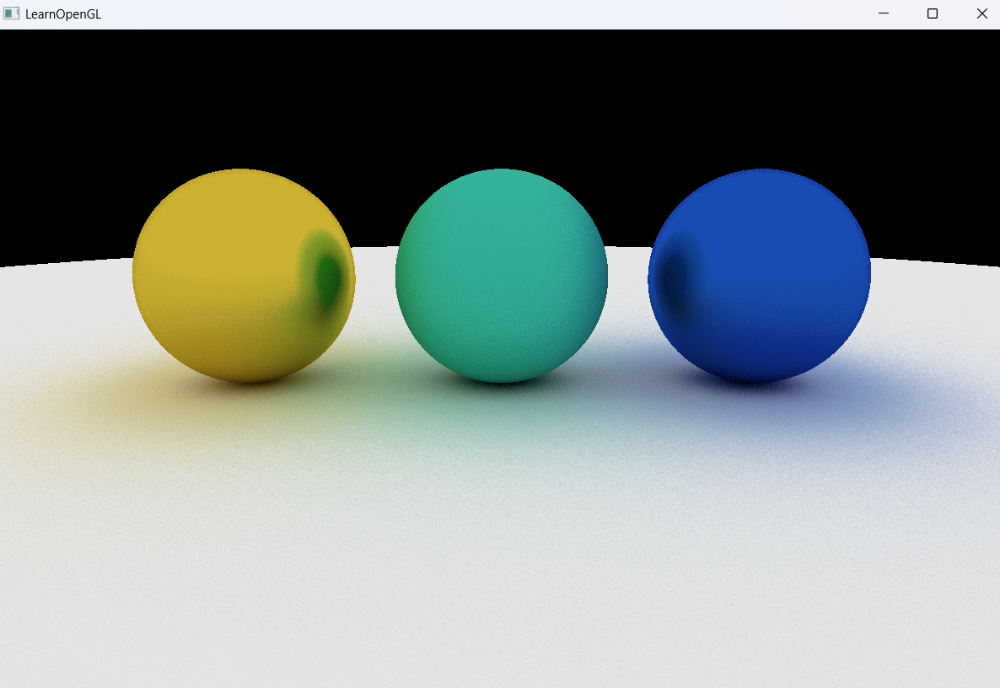

# 01_Raytracing_05

## 项目简介
这是光线追踪系列的第五个示例程序，标志着材质系统的引入，实现了更为真实的视觉效果。本版本简化了场景结构，但增强了渲染细节，通过不同的材质属性实现了金属和漫反射表面的视觉区分，为路径追踪渲染增添了更多的真实感。

## 核心创新
- **材质系统实现**：首次引入材质类型区分（漫反射、金属）
- **物体颜色控制**：每个球体拥有独立的颜色属性
- **场景艺术化布局**：三个小球横向排列，具有视觉平衡感
- **硬编码场景定义**：取代循环生成，实现更精确的场景控制
- **视觉效果提升**：材质差异化带来更真实的光照反射效果

## 场景布局
```cpp
// 左侧金属球（黄色）
RayTracerShader.setFloat("sphere[0].radius", 0.5);
RayTracerShader.setVec3("sphere[0].center", glm::vec3(-1.2, 0.0, -1.0));
RayTracerShader.setInt("sphere[0].materialIndex", 1); // 金属
RayTracerShader.setVec3("sphere[0].albedo", glm::vec3(0.8, 0.7, 0.2));

// 中间漫反射球（绿色）
RayTracerShader.setFloat("sphere[1].radius", 0.5);
RayTracerShader.setVec3("sphere[1].center", glm::vec3(0.0, 0.0, -1.0));
RayTracerShader.setInt("sphere[1].materialIndex", 0); // 漫反射
RayTracerShader.setVec3("sphere[1].albedo", glm::vec3(0.2, 0.7, 0.6)); 

// 右侧金属球（蓝色）
RayTracerShader.setFloat("sphere[2].radius", 0.5);
RayTracerShader.setVec3("sphere[2].center", glm::vec3(1.2, 0.0, -1.0));
RayTracerShader.setInt("sphere[2].materialIndex", 1); // 金属
RayTracerShader.setVec3("sphere[2].albedo", glm::vec3(0.1, 0.3, 0.7));

// 地面（白色漫反射）
RayTracerShader.setFloat("sphere[3].radius", 100.0);
RayTracerShader.setVec3("sphere[3].center", glm::vec3(0.0, -100.5, -1.0));
RayTracerShader.setInt("sphere[3].materialIndex", 0); // 漫反射
RayTracerShader.setVec3("sphere[3].albedo", glm::vec3(0.9, 0.9, 0.9));
```

## 材质系统
本版本引入两种基本材质类型：
1. **漫反射材质(0)**：
   - 光线在碰到表面后向随机方向散射
   - 会逐渐吸收光线能量，呈现哑光效果
   - 典型应用：布料、纸张、哑光涂料表面

2. **金属材质(1)**：
   - 反射方向更加确定，遵循反射定律
   - 保留更多入射光线能量，呈现光泽感
   - 典型应用：金属表面、镜面

## 材质与颜色组合
- 黄色金属球：明亮的金属质感，高光反射
- 绿色漫反射球：柔和的哑光效果
- 蓝色金属球：冰冷的金属光泽
- 白色地面：均匀散射的漫反射表面

## 渲染技术实现
- **材质分支处理**：根据材质类型执行不同的BRDF计算
- **颜色继承**：光线反射时考虑表面颜色对光线颜色的影响
- **多次弹射**：实现光线在不同材质间的多次交互
- **表面散射**：模拟不同材质的微观几何特性

## 与前版本的关键区别
| 特性 | 01_Raytracing_04 | 01_Raytracing_05 |
|------|------------------|-----------------|
| 球体数量 | 10个球体 | 4个球体 |
| 场景布局 | 3×3网格排列 | 艺术化水平排列 |
| 材质系统 | 单一材质 | 漫反射和金属材质 |
| 颜色控制 | 无独立颜色 | 每个球体独立颜色 |
| 视觉效果 | 基础路径追踪 | 材质差异化渲染 |



