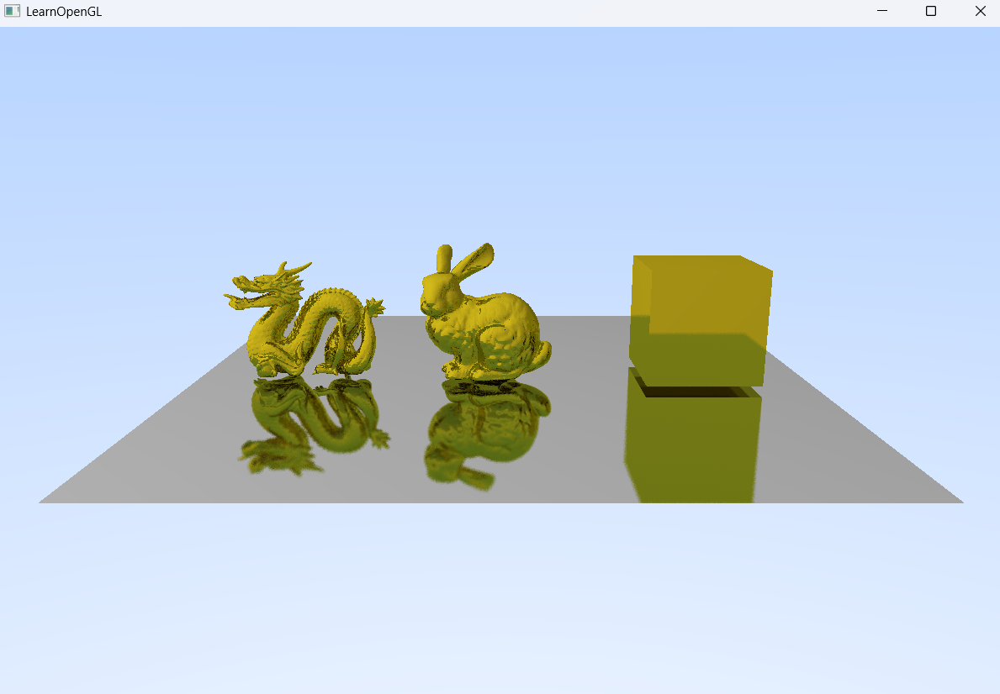

# 03_Raytracing_04


## 项目简介
这是光线追踪系列的第三阶段第四个示例程序，实现了基于BVH加速结构的复杂三维模型光线追踪渲染。本版本首次引入了经典的Stanford模型（龙和兔子）和优化的空间划分算法，大幅提高了复杂场景的渲染性能和细节表现。

## 核心创新
- **BVH加速结构**：实现高效的空间划分算法，显著提升渲染性能
- **复杂三维模型加载**：支持加载和渲染任意三角形网格模型
- **ImGui交互界面**：集成图形用户界面，提供直观的参数控制
- **增强的相机控制**：实现旋转、平移和缩放等多种相机交互模式
- **GPU数据传输优化**：通过纹理缓冲高效传递大规模几何数据

## 场景内容
```cpp
// 加载三个经典3D模型
Model dragon("../static/model/dragon/dragon.obj");
Model bunny("../static/model/bunny/bunny.obj");
Model box("../static/model/box/box.obj");

// 设置缩放和位置
getTexture(dragon.meshes, RayTracerShader, ObjTex, primitives, bvhTree, 0.04, glm::vec3(-0.7,-0.2,0.0));
getTexture(bunny.meshes, RayTracerShader, ObjTex, primitives, bvhTree, 3.0, glm::vec3(0.0,-0.3,0.0));
getTexture(box.meshes, RayTracerShader, ObjTex, primitives, bvhTree, 0.2, glm::vec3(0.7, 0.0, 0.0));

// 构建BVH树
bvhTree.BVHBuildTree(primitives, 24);
```

## BVH加速结构
本版本实现了边界体层次结构(Bounding Volume Hierarchy)，这是一种重要的空间划分算法：
- **原理**：将空间递归地划分为包含部分几何体的边界盒
- **构建**：通过`BVHBuildTree`函数构建24层深度的BVH树
- **优势**：将光线-三角形相交检测从O(N)降低到O(log N)
- **适用性**：特别适合处理斯坦福龙等高复杂度模型

## GPU数据传输
为高效传输几何数据到GPU，实现了基于纹理的数据结构：
```cpp
// RayTracerShader 纹理序号：
// 纹理0：Framebuffer
// 纹理1：MeshVertex
// 纹理2：MeshFaceIndex
```

## 交互系统升级
实现了多模式的相机控制系统：
```cpp
// 左键：视角旋转
if (cam.isRotating) {
    cam.RotationSensitivity = 0.1f;
    cam.ProcessRotationByPosition(xpos, ypos);
}
// 右键：视角平移
else if (cam.isPanning) {      
    cam.PanSensitivity = 0.003f;
    cam.ProcessPanByPosition(xpos, ypos);
}
// 滚轮：缩放控制（支持Shift加速）
float actualSpeed = baseSpeed;
if (glfwGetKey(window, GLFW_KEY_LEFT_SHIFT) == GLFW_PRESS) {
    actualSpeed *= shiftMultiplier;
}
```

## 渲染管线
本版本保持了双缓冲的渐进式路径追踪框架，但增加了几个关键步骤：
1. **几何数据预处理**：模型加载和BVH构建
2. **纹理生成**：将三角形数据转换为GPU纹理
3. **光线追踪**：使用BVH加速的光线-三角形相交计算
4. **帧累积渲染**：多帧渐进式路径追踪
5. **结果显示**：将渲染结果显示到屏幕

## 技术特点对比
| 特性 | 前代版本 | 03_Raytracing_04 |
|------|----------|-----------------|
| 几何复杂度 | 简单模型(几个三角形) | 复杂模型(数万三角形) |
| 加速结构 | 无 | BVH树 |
| 交互模式 | 简单相机控制 | 多模式相机控制 |
| UI系统 | 无 | ImGui集成 |
| 性能表现 | 适用于简单场景 | 支持复杂场景实时渲染 |


