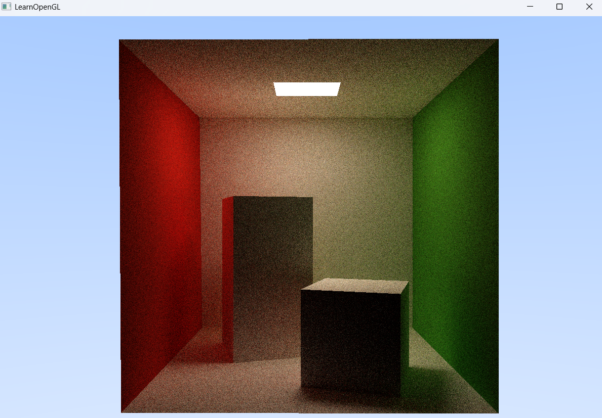

# 03_Raytracing_05

## 项目简介
这是光线追踪系列的第三阶段第五个示例程序，实现了经典的Cornell Box场景渲染，标志着向物理精确光照模拟的重要进步。本版本引入了基于面积光源的全局光照系统和高级材质属性，创造出更真实的光照效果和色彩互动。

## 核心突破
- **Cornell Box场景实现**：重现计算机图形学中最经典的测试场景
- **面积光源支持**：实现基于物理的区域光照计算
- **材质系统扩展**：引入发光材质和更精确的漫反射材质
- **颜色互溢效果**：准确模拟不同表面之间的光线反弹和颜色传递
- **深度优化的BVH**：BVH树深度从24增加到42，提供更高精度的加速

## 材质系统升级
```cpp
// 光源材质（发光）
Material light;
light.transmission = -1.0f;  // 负值表示发光材质
light.emissive = 8.0f * glm::vec3(0.747f+0.058f, 0.747f+0.258f, 0.747f) 
               + 15.6f * glm::vec3(0.740f+0.287f, 0.740f+0.160f, 0.740f) 
               + 18.4f * glm::vec3(0.737f+0.642f, 0.737f+0.159f, 0.737f);
light.baseColor = glm::vec3(1.0f, 1.0f, 1.0f);

// 红色墙壁材质（漫反射）
Material red;
red.transmission = 0.0f;
red.baseColor = glm::vec3(0.63f, 0.065f, 0.05f);

// 绿色墙壁材质（漫反射）
Material green;
green.transmission = 0.0f;
green.baseColor = glm::vec3(0.14f, 0.45f, 0.091f);

// 白色材质（漫反射）
Material white;
white.transmission = 0.0f;
white.baseColor = glm::vec3(0.725f, 0.71f, 0.68f);
```

## Cornell Box场景构成
```cpp
// 加载Cornell Box各个部分
Model tallbox("../static/model/cornellbox/tallbox.obj");
getTextureWithTransform(tallbox.meshes, RayTracerShader, ObjTex, primitives, bvhTree, 
                      glm::vec3(0.0f, 0.0f, 0.0f), 0.001f, 180.0f, glm::vec3(0.0f, 1.0f, 0.0f),
                      white); // 高盒子，白色材质

Model shortbox("../static/model/cornellbox/shortbox.obj");
getTextureWithTransform(shortbox.meshes, RayTracerShader, ObjTex, primitives, bvhTree, 
                       glm::vec3(0.0f, 0.0f, 0.0f), 0.001f, 180.0f, glm::vec3(0.0f, 1.0f, 0.0f),
                       white); // 矮盒子，白色材质
                       
Model floor("../static/model/cornellbox/floor.obj");
// 地面，白色材质

Model right("../static/model/cornellbox/right.obj");
// 右墙，绿色材质

Model left("../static/model/cornellbox/left.obj");
// 左墙，红色材质

Model areaLight("../static/model/cornellbox/light.obj");
// 顶部面光源，发光材质
```

## 光源物理特性
本版本实现了基于物理的面光源，为场景提供自然光照：
- **面光源**：不是点光源，而是有实际面积的发光体
- **物理精确光谱**：模拟真实光源的光谱分布
- **能量守恒**：符合光能量传输的物理规律
- **颜色互溢**：准确模拟红绿墙壁之间的颜色互相反射

## 渲染技术亮点
- **间接光照**：光线可多次弹射，捕捉复杂的间接光照效果
- **软阴影**：面光源自然产生的软阴影效果，增强真实感
- **色彩反射**：墙壁颜色会影响附近物体的颜色表现
- **BVH优化**：高深度BVH树（42层）确保复杂场景的高效渲染

## 物理光照模型
Cornell Box场景展示了几个关键的光照现象：
1. **直接光照**：光源直接照射场景物体
2. **间接光照**：光线从墙壁和物体表面反弹
3. **颜色混合**：红墙和绿墙会在白色物体上投射淡淡的色彩
4. **软阴影**：由面光源产生的具有软边缘的自然阴影

## 与前版本的区别
| 特性 | 03_Raytracing_04 | 03_Raytracing_05 |
|------|------------------|------------------|
| 场景 | Stanford模型(龙、兔子、盒子) | Cornell Box经典场景 |
| 光源 | 无显式光源 | 物理精确的面光源 |
| 材质系统 | 基本材质 | 扩展材质(含发光材质) |
| 全局光照 | 简单模型 | 物理精确的光能传输 |
| BVH深度 | 24层 | 42层 |
| 视觉重点 | 几何复杂度 | 光照和色彩真实感 |

## 技术参考
Cornell Box是由Cornell University的研究人员创建的标准测试场景，用于验证全局光照算法的准确性。其特点包括：
- 简单的几何形状
- 有对比度的材质（红、绿、白）
- 顶部可控光源
- 便于比较不同渲染算法的结果


