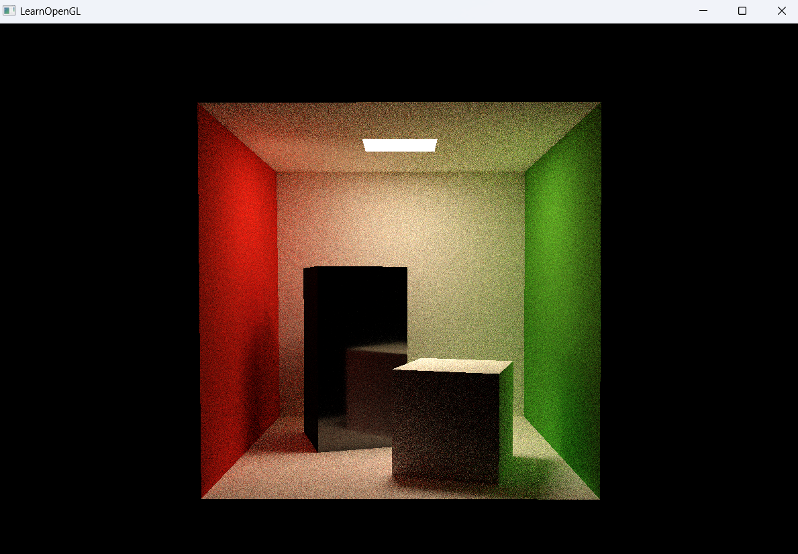

# 03_Raytracing_06

## 项目简介
这是光线追踪系列的第三阶段第六个示例程序，标志着材质系统的进一步完善与优化。在延续Cornell Box经典场景的基础上，新增了具有镜面反射特性的材质，实现了更丰富的光照效果和视觉表现，向真实感渲染迈出重要一步。

## 核心突破
- **镜面反射材质**：实现基于物理的镜面反射计算
- **材质差异化**：同一场景中混合使用不同类型材质
- **Cornell Box增强**：经典场景中添加镜面元素，创造更丰富视觉效果
- **光线交互优化**：精确模拟光线在不同材质表面的反射、散射行为
- **视觉真实感提升**：通过材质对比增强场景立体感和真实感

## 材质系统扩展
```cpp
// 原有的漫反射白色材质
Material white;
white.transmission = 0.0f;  // 漫反射
white.baseColor = glm::vec3(0.725f, 0.71f, 0.68f);

// 新增的镜面反射材质
Material white2;
white2.transmission = 1.0f;  // 镜面反射
white2.roughness = 0.01f;    // 极低的粗糙度，接近完美镜面
white2.baseColor = glm::vec3(0.725f, 0.71f, 0.68f);
```

## 场景材质配置
```cpp
// 高盒子使用镜面反射材质
Model tallbox("../static/model/cornellbox/tallbox.obj");
getTextureWithTransform(tallbox.meshes, RayTracerShader, ObjTex, primitives, bvhTree, 
                      glm::vec3(0.0f, 0.0f, 0.0f), 0.001f, 180.0f, glm::vec3(0.0f, 1.0f, 0.0f),
                      white2);  // 镜面反射材质

// 矮盒子保持漫反射材质
Model shortbox("../static/model/cornellbox/shortbox.obj");
getTextureWithTransform(shortbox.meshes, RayTracerShader, ObjTex, primitives, bvhTree, 
                       glm::vec3(0.0f, 0.0f, 0.0f), 0.001f, 180.0f, glm::vec3(0.0f, 1.0f, 0.0f),
                       white);  // 漫反射材质
```

## 材质交互物理模型
本版本实现了三种关键材质类型的物理模型：
1. **漫反射材质 (transmission=0)**：
   - 光线在表面随机散射，符合Lambert定律
   - 反射光线保留表面颜色特性
   - 能量部分被吸收，部分被散射

2. **镜面反射材质 (transmission=1)**：
   - 入射角等于反射角
   - 极低的roughness值(0.01)确保反射的清晰度
   - 反射时保留大部分能量，呈现明亮的镜面效果

3. **发光材质 (transmission=-1)**：
   - 作为场景光源，主动发射光线
   - 光谱分布接近自然光源

## 视觉效果提升
- **盒子之间的相互反射**：镜面高盒子反射出矮盒子和墙壁的图像
- **色彩互动**：红绿墙壁的颜色在镜面反射中清晰可见
- **复杂光路**：光线可在镜面和漫反射表面之间多次弹射
- **阴影差异**：镜面和漫反射物体产生不同特性的阴影

## 技术实现细节
- **透射率计算**：基于菲涅尔方程的透射率计算
- **roughness参数**：控制镜面反射的模糊程度
- **BVH优化**：42层深度的BVH树确保场景高效渲染
- **采样策略**：针对不同材质采用不同的采样策略

## 与前版本的对比
| 特性 | 03_Raytracing_05 | 03_Raytracing_06 |
|------|------------------|------------------|
| 材质类型 | 漫反射+发光 | 漫反射+镜面反射+发光 |
| 高盒子材质 | 漫反射 | 镜面反射 |
| 视觉复杂度 | 直接光照+间接光照 | 直接光照+间接光照+镜面反射 |
| 计算复杂度 | 中等 | 高 |
| 渲染收敛性 | 较快 | 较慢(镜面反射需更多采样) |

## 物理光照特性
本版本特别展示了几种重要的光照交互现象：
- **镜面反射**：类似镜子的清晰反射
- **菲涅尔效应**：从不同角度观察时镜面反射强度的变化
- **焦散**：通过镜面反射后的光线聚集现象
- **多重反射**：光线在多个表面之间的复杂弹射路径



