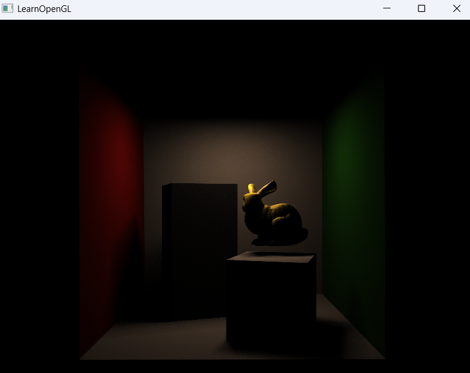
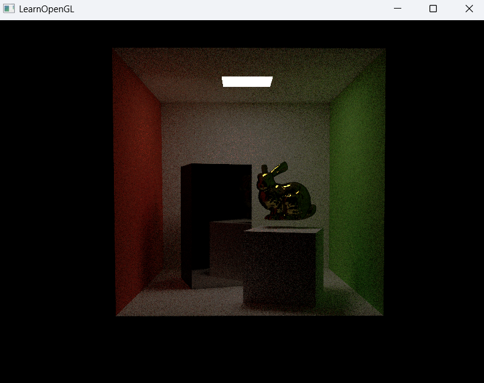
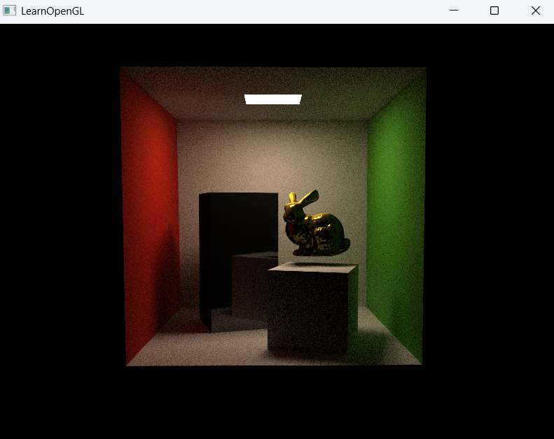

# 03_Raytracing_07

## 项目简介
这是光线追踪系列的第三阶段最终版本，实现了基于物理的光线传输模型、高级材质系统和分离式光照计算。本版本通过分解直接光照与间接光照的计算，不仅提供了更清晰的渲染管线，也实现了更真实、更丰富的光照效果和完整的全局光照解决方案。

## 核心创新
- **光照计算分离**：分别计算直接光照和间接光照，然后合成最终结果
- **精确光源采样**：实现对面积光源的精确几何表示和采样
- **透明材质支持**：引入基于物理的折射材质系统
- **兔子模型添加**：场景中加入Stanford兔子，丰富视觉效果
- **材质系统完善**：支持全面的材质属性，包括漫反射、金属反射和透明折射

## 材质系统全景
```cpp
// 发光材质（光源）
Material light;
light.transmission = -1.0f;  // 负值表示发光
light.emissive = /* 复杂的光谱分布 */;

// 漫反射材质（红色、绿色、白色等）
Material red;
red.transmission = 0.0f;     // 0表示漫反射
red.baseColor = glm::vec3(0.63f, 0.065f, 0.05f);

// 金属材质（反射）
Material metal_white;
metal_white.transmission = 1.0f;  // 1表示镜面反射
metal_white.roughness = 0.01f;    // 低粗糙度，接近完美镜面
metal_white.baseColor = glm::vec3(0.725f, 0.71f, 0.68f);

// 透明材质（折射）
Material transparency_yellow;
transparency_yellow.transmission = 2.0f;  // 2表示透明折射
transparency_yellow.roughness = 0.1f;     // 控制表面微观结构
transparency_yellow.IOR = 1.6f;           // 折射率
transparency_yellow.baseColor = glm::vec3(0.95f, 0.85f, 0.3f);
```

## 场景构成
本版本构建了一个丰富的Cornell Box场景，包含以下元素：
```cpp
// 高盒子（金属镜面）
getTextureWithTransform(tallbox.meshes, RayTracerShader, ObjTex, primitives, bvhTree, 
                      glm::vec3(0.0f, 0.0f, 0.0f), 0.001f, 180.0f, glm::vec3(0.0f, 1.0f, 0.0f),
                      metal_white);

// 矮盒子（漫反射白色）
getTextureWithTransform(shortbox.meshes, RayTracerShader, ObjTex, primitives, bvhTree, 
                       glm::vec3(0.0f, 0.0f, 0.0f), 0.001f, 180.0f, glm::vec3(0.0f, 1.0f, 0.0f),
                       white);

// Stanford兔子（金属黄色） - 新增元素
getTextureWithTransform(bunny.meshes, RayTracerShader, ObjTex, primitives, bvhTree, 
                       glm::vec3(-0.16f, 0.15f, -0.25f), 1.0f, 0.0f, glm::vec3(0.0f, 1.0f, 0.0f),
                       metal_yellow);
```

## 光照计算系统
本版本实现了分离式光照计算方法，带来以下优势：

### 直接光照
- **光源精确表示**：通过三角形表示面光源
- **显式光源采样**：计算光源对场景直接照明的贡献
- **阴影计算**：确定点到光源之间是否有遮挡物
- **特点**：清晰的光影效果，但缺乏材质间的色彩交互

### 间接光照
- **蒙特卡洛路径追踪**：通过随机采样模拟光线多次弹射
- **俄罗斯轮盘赌**：路径追踪的智能终止策略
- **材质系统交互**：模拟不同材质对光线的影响
- **特点**：柔和的色彩互溢效果，但噪点较多，需要长时间累积

### 综合效果
- **物理准确的光照模拟**：直接光照与间接光照的叠加
- **真实的视觉表现**：同时具备清晰的光影和丰富的色彩交互
- **收敛性能平衡**：兼顾渲染质量和计算效率

## 精确光源处理
本版本实现了对光源的精确几何表示和变换：
```cpp
// 光源变换矩阵计算
glm::mat4 modelMatrix = glm::mat4(1.0f);
modelMatrix = glm::translate(modelMatrix, glm::vec3(0.0f, 0.0f, 0.0f));
modelMatrix = glm::scale(modelMatrix, glm::vec3(0.001f));
modelMatrix = glm::rotate(modelMatrix, glm::radians(180.0f), glm::vec3(0.0f, 1.0f, 0.0f));

// 变换后的光源顶点传递给着色器
RayTracerShader.setVec3("triLight[0].p0", transformedLightVertices[0]);
RayTracerShader.setVec3("triLight[0].p1", transformedLightVertices[1]);
RayTracerShader.setVec3("triLight[0].p2", transformedLightVertices[2]);
```

## 性能优化
- **分辨率调整**：从1200×800降至800×600，提高渲染速度
- **BVH深度优化**：42层深度的BVH树确保场景高效渲染
- **光照计算分离**：允许单独优化直接光照和间接光照的计算

## 渲染结果展示

### 直接光照 结果
只计算光线从光源直接到达表面的照明效果。特点是光影分明，但缺乏反射和环境光。


### 间接光照 结果
只计算光线在场景中多次弹射产生的照明效果。特点是柔和的色彩互溢，但整体较暗。


### 直接光照+间接光照 结果
结合两种光照计算方式，获得物理精确的完整照明效果。兼具清晰的光影和丰富的色彩互溢。
